

# a11g-final-submission

**Team Number: 03**

**Team Name: PantryOS**

| Team Member Name | Email Address          | GitHub Username |
| ---------------- | ---------------------- | --------------- |
| Harita Trivedi   | haritant@seas.upenn.edu| haritant        |
| Arik Singh       | ags007@seas.upenn.edu  | ariksingh007    |

**GitHub Repository URL: https://github.com/ese5160/a11g-final-submission-s26-s26-t03-pantryos-1**

## 1. Video Presentation

https://www.youtube.com/watch?v=t6V7ENgFceo

## 2. Project Summary

### Device Description

**What is PantryOS?**  
PantryOS is a smart pantry monitoring device built around a custom Silicon Labs MCU on an IoT PCBA that combines temperature/humidity sensing, proximity detection, barcode scanning, servo actuation, and Wi-Fi connectivity. It communicates with a Node-RED dashboard over MQTT so a user can scan pantry items, enter purchase and expiration dates, monitor environmental conditions, and visualize overall pantry freshness in real time.

**Motivation / Problem**  
This project was inspired by a need to better track grocery freshness and maintain a live inventory of pantry items. We wanted a system that provides a clear, visual representation of food freshness while also helping users understand what they currently have available. A future extension of this idea is recipe suggestion based on available ingredients.

**Use of the Internet**  
The device connects to a Node-RED dashboard over Wi-Fi using MQTT, allowing it to publish real-time sensor data and receive user inputs. This enables remote inventory tracking, environmental monitoring, freshness visualization, time synchronization, and OTA firmware updates—significantly enhancing usability beyond the standalone device.

---

### Device Functionality

PantryOS is built around a **Silicon Labs SIWG917 MCU** on a custom PCBA, which acts as the central controller for sensing, actuation, and communication.

**Key Components:**
- **Sensors:**
  - SHT40 (temperature & humidity, I2C)
  - VCNL4040 (proximity sensor, I2C)
- **Actuator:**
  - SG90 servo (indicates pantry freshness)
- **Input System:**
  - DE2120 barcode scanner (UART)
- **Connectivity:**
  - Wi-Fi + MQTT → Node-RED dashboard

The system allows users to scan items, log expiration dates, and monitor pantry conditions through a connected dashboard.

---

### Challenges

We faced several challenges across hardware, firmware, and system integration:

- **Lost UART Debug Access**
  - Accidentally removed UART debug pins in PCB design
  - → Switched to SEGGER RTT logging

- **Servo Power Issues**
  - SG90 servo overloaded the onboard 5V rail and damaged it
  - → Moved servo to external power source

- **Barcode Scanner Integration**
  - Required careful UART buffering and synchronization with FreeRTOS tasks
  - → Improved parsing and event-driven handling

- **Proximity Sensor Reliability**
  - Interrupt-based triggering was unstable
  - → Switched to polling via I2C values for reliability

---

### Prototype Learnings

- Hardware limitations (especially power design) can break an otherwise solid system
- Small PCB mistakes (routing, pin selection) can have major downstream impacts
- Simpler MQTT topic structures made debugging Node-RED significantly easier
- The dashboard should reflect real device state directly—not infer logic
- Most importantly: **hardware, firmware, and cloud systems must be designed together**

---

### What We Would Do Differently

- Perform a **full net-by-net PCB review** before fabrication
- Redesign the **5V power path** to properly support servo loads
- Add **more accessible GPIO/test points** for debugging flexibility
- Preserve **UART debugging access**
- Validate pin mappings earlier (especially I2C compatibility)

---

### Next Steps & Takeaways

**Future Improvements:**
- Renew cloud infrastructure (Azure Node-RED hosting expired)
- Expand barcode database for better item recognition
- Implement recipe recommendation system based on inventory
- Add AI-based suggestions for meals and food usage

**Course Takeaways:**
ESE5160 taught us how to build a complete IoT system—from PCB design and power architecture to firmware, RTOS, cloud integration, and debugging. The biggest lesson was that success depends on tight coordination across all layers of the system.

---

### Project Links

- **Node-RED Backend:** http://172.212.177.245:1880/  
- **Node-RED Dashboard:** http://172.212.177.245:1880/ui  
⚠️ Note: Azure hosting expired April 30, 2026

- **Altium 365 Design:**  
https://upenn-eselabs.365.altium.com/designs/folder-DC856870-9335-4574-956F-E6FD47C46101

## 3. Hardware & Software Requirements

## Hardware Requirements

---

### HRS-01 MCU

**Description:**  
The system shall use SIWG917Y121MGABA as the primary microcontroller. The MCU shall support execution of FreeRTOS.  
The MCU shall expose the following hardware interfaces:  
- I2C (for sensors and RFID reader)  
- PWM (for servo control)  
- Debug/programming interface (SWD/JTAG and/or UART)  
The MCU shall support concurrent operation of sensing, actuation, and wireless communication (BLE and Wi-Fi).

**Validation:**  
Verified via FreeRTOS execution, sensor communication, PWM control, and RTT logging.

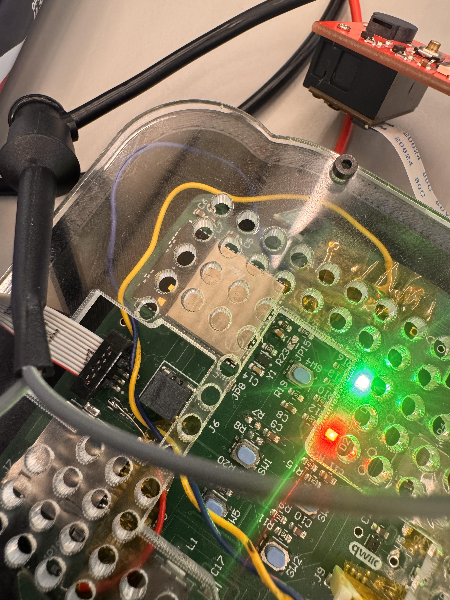

---

### HRS-02 Power System

**Description:**  
The system shall operate from a single-cell Li-Ion battery.  
- Nominal voltage: 3.7 V  
- Capacity: 2200 mAh  

The system shall support low-power sleep modes with wake sources including:  
- Timer  
- Barcode scan input  
- Button press  

The system shall include buck-boost or boost regulation to support peripherals requiring voltages above the battery nominal voltage (e.g., 5 V servo).  

The system shall support both:  
- Low-power mode (duty-cycled sensing and communication)  
- Connected mode (continuous Wi-Fi/MQTT operation with higher power consumption)  

Target power characteristics:  
- Idle current (sleep + periodic sensing): ≤ 20 mA  
- Peak current (Wi-Fi transmit + servo actuation): ≤ 300 mA  

The system shall demonstrate a minimum runtime of 24 hours.  

**Validation:**  
*** we had to use a power supply for 5V rail since we blew it out  
- No low power states implemented  
3.3 V boost✅  

Power measurement (taken with an inline USB-C measuring device, which is verified with power supply readings)  
- 38 mA, 0.196W nominal on USB-C  
- 166 mA, 0.857W when barcode scanning on  

Runtime??? With fluctuating current draws it is difficult to determine at this time. In the future, I would get more accurate power measurements using a Power Profiler.

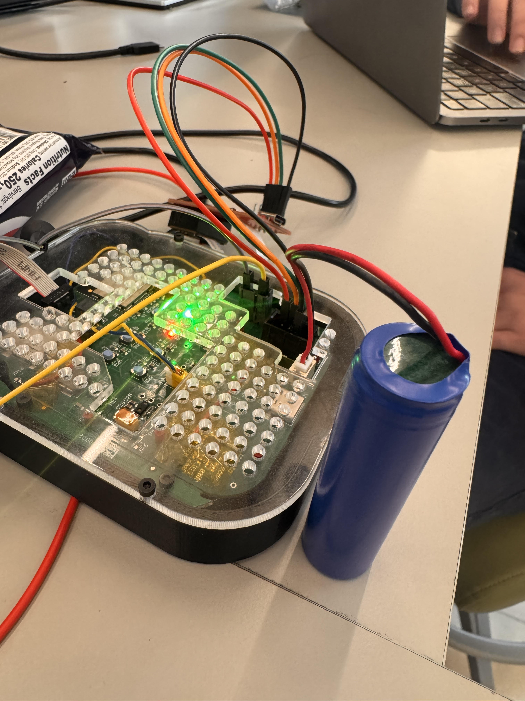
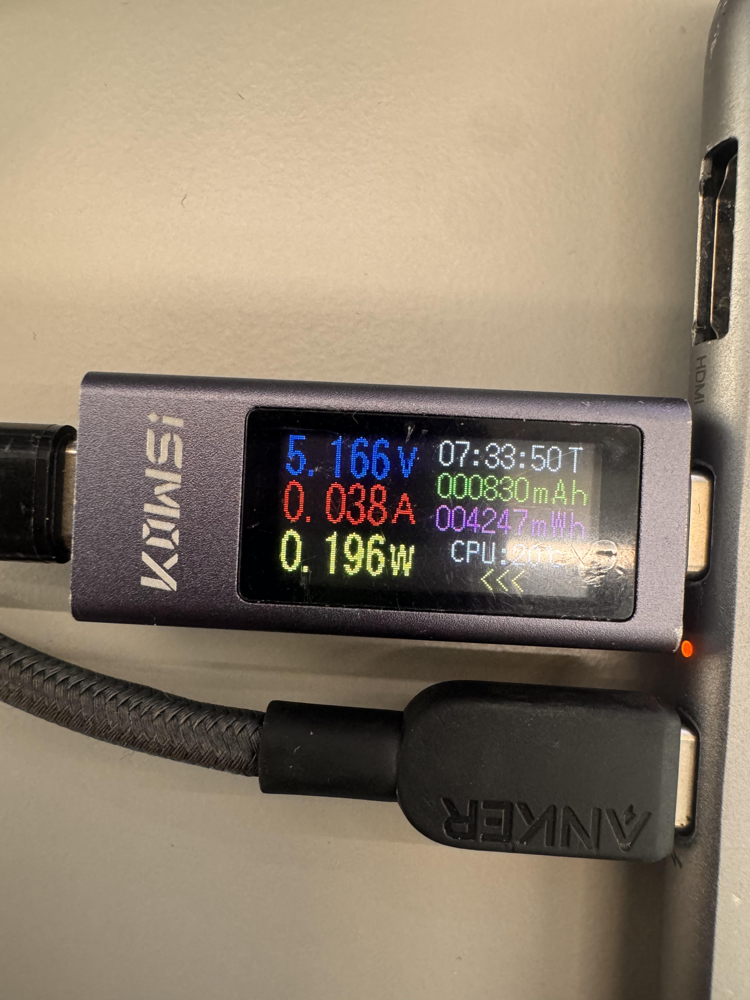
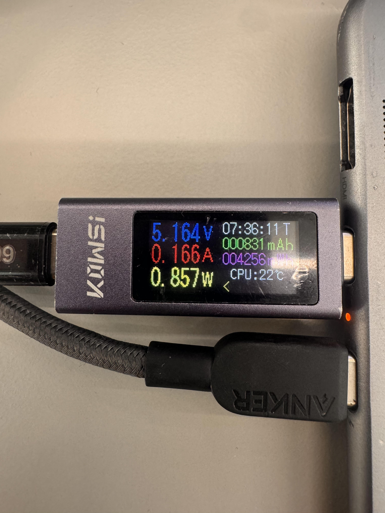

---

### HRS-03 Sensors

**Description:**  
The system shall include at least one food-relevant environmental sensor connected via I2C.  

Temperature Sensor:  
- Measurement range: 0 °C to 50 °C  
- Accuracy: ±0.5 °C  
- Resolution: ≤ 0.1 °C  

Humidity Sensor:  
- Measurement range: 20%–90% RH  
- Accuracy: ±3% RH  
- Resolution: ≤ 1% RH  

Sensor hardware shall support sampling at a rate of at least once per minute.  

**Validation:**  
Temperature and humidity sensor✅  

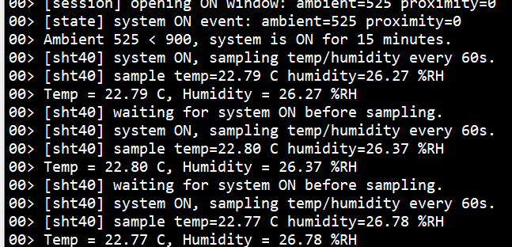

---

### HRS-04 Barcode Scanner

**Description:**  
The system shall include a barcode scanner for item identification.  
The barcode scanner shall interface with the MCU via UART, USB, or equivalent.  
The scanner shall provide decoded barcode data to the MCU.  

**Validation:**  
UART barcode scanner✅  

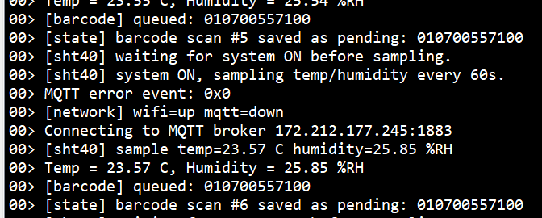
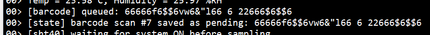

---

### HRS-05 Wireless Communication

**Description:**  
The system shall support wireless communication using BLE and Wi-Fi.  

**Validation:**  
Only used Wi-Fi  
- Ran out of credits, so difficult to verify  

---

### HRS-06 Actuation & Indicators

**Description:**  
The system shall include:  
- A servo motor for actuation  
- Status LEDs for user feedback  

Requirements:  
- Servo supply voltage: 5V  
- Angular accuracy: ±5°  

**Validation:**  
Servo motor✅  
- 5V from power supply  
- Only updates when freshness value changes  

No status LEDs  

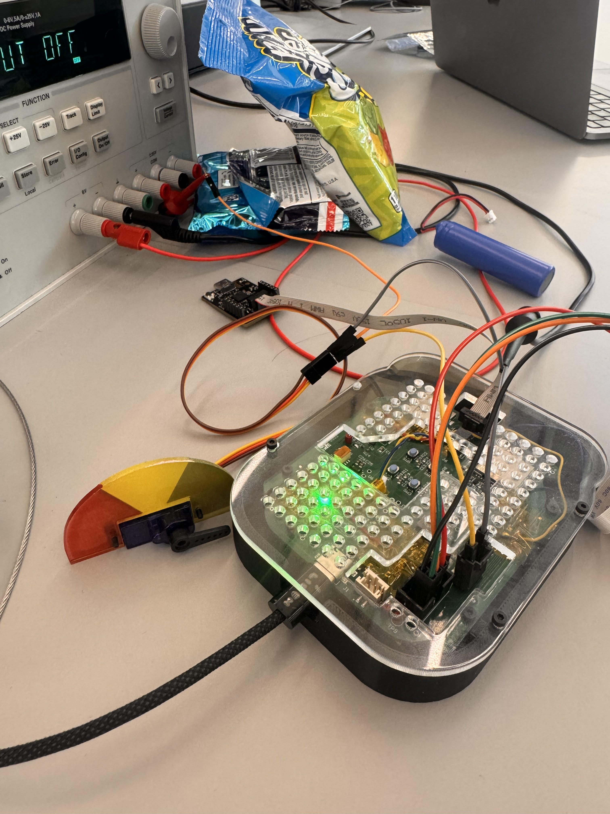
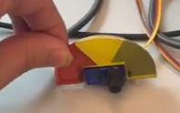

---

### HRS-07 Debug & Programming

**Description:**  
The system shall include a hardware debug/programming port.  

**Validation:**  
Implemented Segger RTT  

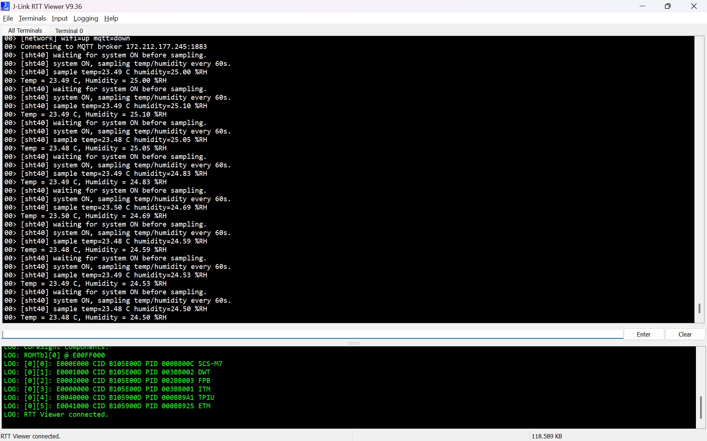

---

### HRS-08 Cost Constraint

**Description:**  
The cost of sensors and actuators shall be ≤ $30  

**Validation:**  
w/o barcode scanner: $4.79  
W barcode scanner: $71.74  

---

## Software Requirements

---

### SRS-01 Firmware Platform

**Description:**  
The firmware shall run on FreeRTOS.  

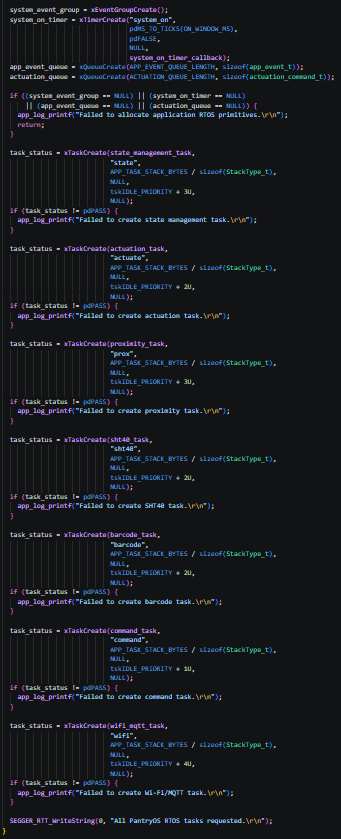

---

### SRS-02 Tasking & Concurrency Model

**Description:**  
The system shall use an event-driven architecture.  

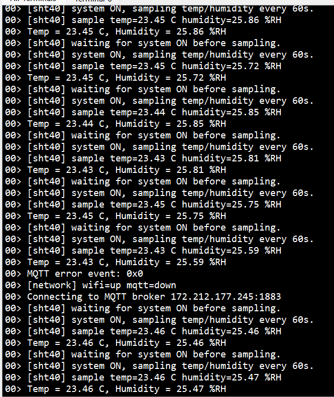

---

### SRS-03 Data Model & Persistence

**Validation:**  
Did not store inventory in nonvolatile memory  

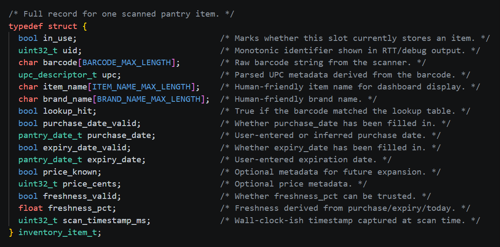

---

### SRS-04 Barcode Scan Behavior

---

### SRS-05 BLE Functionality

Did not use BLE  

---

### SRS-06 Sensor Sampling & Freshness Computation

Freshness Test✅  

---

### SRS-07 Actuation Logic

Actuation Test✅ (~250 ms)  

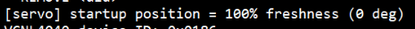
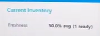

---

### SRS-08 Wi-Fi / MQTT

MQTT test: ran out of credits  

---

### SRS-09 Dish Suggestion & Ratings

Did not implement  

---

### SRS-10 Grocery List Generation

Did not implement  

---

### SRS-11 Low Power Policy

Did not implement  

---

### SRS-12 Debug & Logging

Logs verified  

---

### SRS-13 Acceptance Test Set

- Barcode test✅  
- Duplicate scan test✅  
- Unknown barcode test✅  
- Latency test: ???  
- MQTT test: ran out of credits…  
- Persistence Test: did not implement  
- Freshness Test✅  
- Actuation Test✅  

### Key Validation Results

- **Power Consumption**
  - Idle: ~38 mA  
  - Scanning: ~166 mA  
  - Measured using USB-C power meter  

- **Barcode Performance**
  - Scan latency: ~250 ms  
  - Duplicate scans handled correctly  
  - Unknown barcode handling verified  

- **System Integration**
  - Sensor + actuator + firmware integration verified  
  - MQTT communication verified prior to Azure expiration  

---

### Takeaways

- Core system functionality (sensing, scanning, actuation, Wi-Fi) was successfully implemented  
- Hardware limitations—especially power delivery—significantly impacted design decisions  
- Advanced features (BLE, persistence, low-power) remain future work  
- Full-stack integration (hardware + firmware + cloud) is essential for reliable IoT systems  

## 4. Project Photos & Screenshots

## 5. Codebase

Do *not* commit any of your source code to this repository. Rather, provide links to the other GitHub repository you've already been using with your firmware.

- A link to your final embedded C firmware codebases
- A link to your Node-RED dashboard code
- Links to any other software required for the functionality of your device
